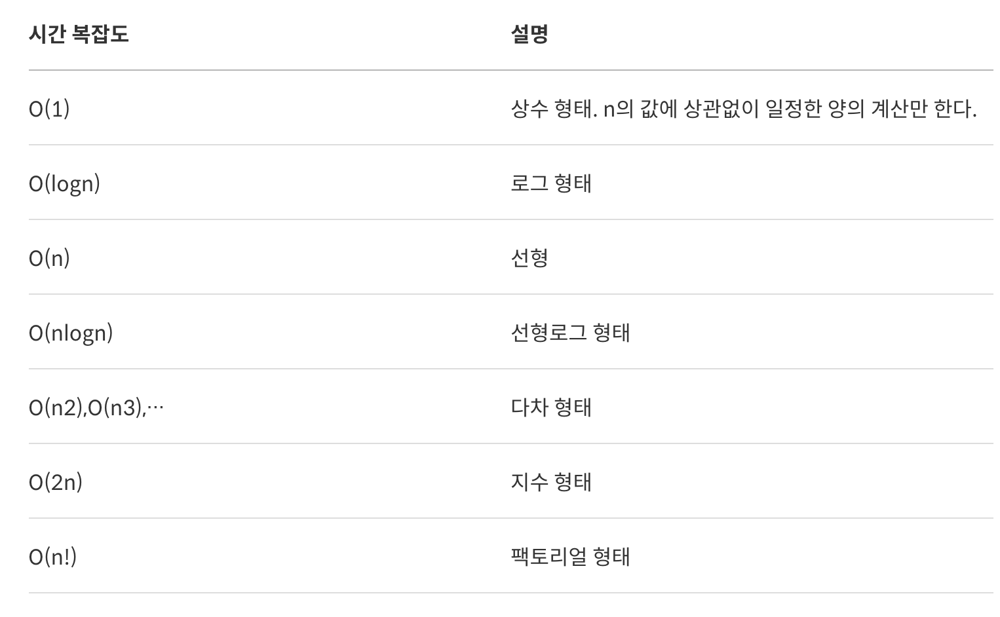
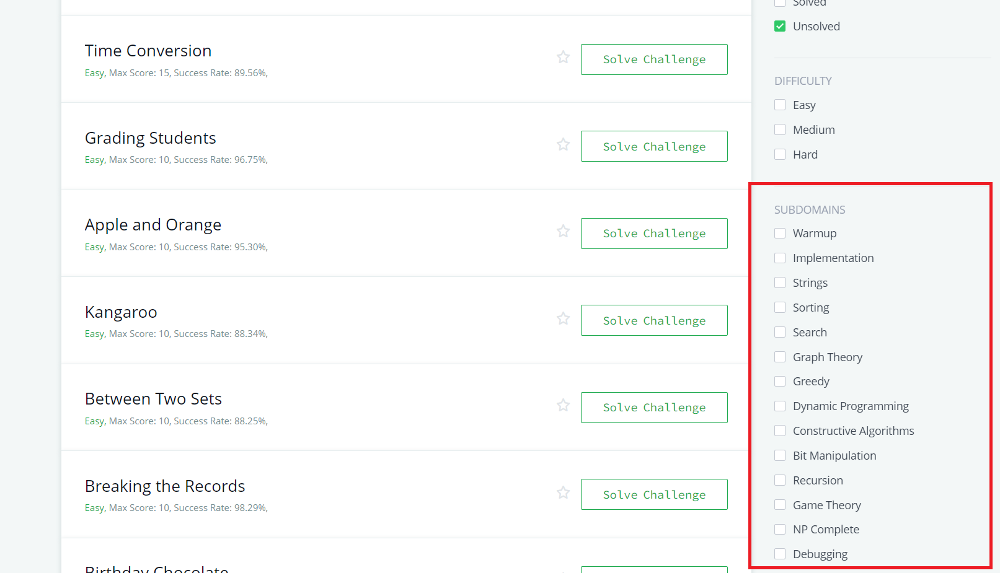
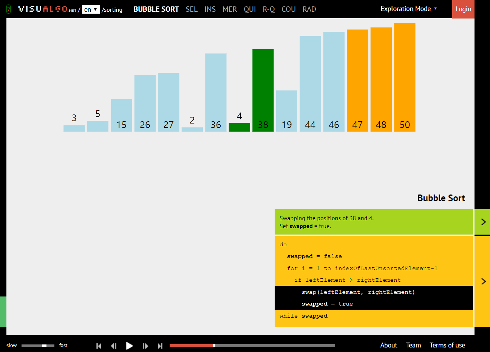

# Algorithm

## 알고리즘의 조건
좋은 알고리즘을 만들기 위해서는 다음과 같은 조건을 충족시켜야 한다.

* 입력 : 외부에서 제공되는 자료가 0개 이상 존재한다.
* 출력 : 적어도 2개 이상의 서로 다른 결과를 내어야 한다. 즉 모든 입력에 하나의 출력- 이 나오면 안 된다.
* 명확성 : 수행 과정은 명확하고 모호하지 않은 명령어로 구성되어야 한다.
* 유한성 : 유한 번의 명령어를 수행 후 유한 시간 내에 종료한다.
* 효율성 : 모든 과정은 명백하게 실행 가능(검증 가능)한 것이어야 한다

## 알고리즘에 필요한 기본 개념

1. [시간 복잡도](#시간-복잡도)
2. 자료구조
3. 정렬

### 시간 복잡도
문제를 해결하는데 걸리는 시간과 입력의 함수 관계 프로그램을 작성할 때에 입력의 크기에 따라서 프로그램이 계산하는 횟수가 크게 달라진다. 입력된 자료의 양과 알고리즘 실행에 걸리는 시간 사이에는 어느 정도의 관계가 있다. 이것을 알고리즘의 시간 복잡도라 한다.

> cf. 메모리 공간을 얼마나 차지하느냐를 계산하는 공간 복잡도라는 개념도 있지만, 저장 기술의 발달로 인해 현재는 시간 복잡도를 우선 고려하는 경우가 많다.

시간 복잡도를 나타낼 때에는 Big O 표기법을 이용한다. 예를 들어서, 1부터 n까지의 합을 구한다고 할 때, 다음과 같은 두 가지 방법이 있다.

```java
// 방법 1
int n, res = 0;
for (int i = 1; i <= n;, i++) {
    res += i;
}
System.out.println(res);
```

```java
// 방법 2
int n, res = 0;
res = n*(n+1)/2;
System.out.println(res);
```

코드를 살펴보면 방법1에서는 for를 이용해 n번의 연산을 하기 때문에 O(n) 의 시간 복잡도를 가진다. 반면 방법2에서는 n의 크기와 상관 없이 1번의 연산을 하기 때문에 O(1) 의 시간 복잡도를 가진다.


맨 위에서부터 시간 복잡도가 낮고 빠르고, 아래로 갈 수록 시간 복잡도가 높고 느려진다. 제한된 시간 안에 올바르게 output을 출력하려면 시간 복잡도를 낮춰야 할 것임을 알 수 있다.

### 자료구조
국내, 국외, 재직자, 면접관 등등 알고리즘 관한 포스트를 읽으면서 모든 사람이 강조하는 것이 자료구조에 대한 공부를 탄탄히 하라는 것이었다. 대기업 코딩테스트나 어려운 알고리즘 문제에서는 자료구조를 모르면 풀지 못 하는 문제도 많다. 흔히 말하는 ‘프로그래밍 잘 하는 법’에서도 빠지지 않는다.

자료구조란, 데이터 사이의 관계를 반영한 저장구조 및 그 조작 방법을 뜻한다. 컴퓨터의 프로그램을 실행하면 CPU에서 메모리로 데이터를 이동해서 처리하는데, 이 때 메모리를 효율적으로 사용하기 위해 데이터에 맞는 특성의 자료구조를 사용하는 것이 중요하다.


이 중에 선형 구조와 비선형 구조의 개념과 종류가 알고리즘 문제에 출제되는 것 같다.

* 선형 자료구조 : 한 종류의 데이터가 선처럼 길게 나열된 자료구조.
* 비선형 자료구조 : 선형 자료구조가 아닌 모든 자료구조. i 번째 값을 탐색한 뒤의 i+1이 정해지지 않은 구조.


### 정렬

[정렬 정리](https://medium.com/@fiv3star/%EC%A0%95%EB%A0%AC%EC%95%8C%EA%B3%A0%EB%A6%AC%EC%A6%98-sorting-algorithm-%EC%A0%95%EB%A6%AC-8ca307269dc7)

* 버블 정렬 - 가장 쉽지만, 시간 복잡도가 높아 효율적이진 않다.
* 선택 정렬 - 버블 정렬과 알고리즘이 유사하다. 가장 큰 수를 찾아 배열의 마지막 위치와 교환한다.
* 삽입 정렬 - 인덱스를 설정하여 현재 위치의 값을 아래쪽으로 순회하며 알맞은 곳에 넣어준다.
* 병합 정렬 - 정렬한 리스트를 반으로 쪼개며 좌우 리스트를 분할해 정렬 후 병합한다. 가장 많이 쓰이는 정렬 중 하나이다.
* 힙 정렬 - 힙이라는 자료구조를 통해 내림차순으로 숫자를 넣은 후, 역순으로 꺼내어 정렬한다.
* 퀵 정렬 - pivot 기준으로 좌측과 우측으로 작은 값과 큰 값을 재배치하고 분할하여 정렬한다.

### 기타 심화 주제
위에서 언급된 것 말고도 다양한 주제들이 있다. 알고리즘 사이트에 가 보면 문제를 선택할 때 주제 별로 필터링을 할 수 있다. 모두 당장 암기가 필요하다기보단, 알고리즘을 풀다가 한 문제씩 튀어나올 때에 ‘이런 풀이법으로 풀면 되는구나’ 하고 자연스럽게 패턴으로 익히는 것이 좋아보인다.

* 다이나믹 프로그래밍(동적 계획법)
* 탐욕법
* [유클리드 호제법 (최대공약수, 최소공배수)](euclidean-algorithm.md)
* 비트 연산
* 진수 변환



---

## 목표

1. 코드-업 쉬운문제 200제 풀기
2. 유형별 알고리즘 이런 & 기출문제 학습
3. 백준 온라인저지/프로그래머스 코딩테스트 연습 유형별 문제 5개 이상 풀기
4. 백준 온라인저지 삼성 SW 역량테스트
5. 프로그래머스 카카오 문제

## 알고리즘 개념 사이트

* [LibreWiki](https://librewiki.net/wiki/%EC%8B%9C%EB%A6%AC%EC%A6%88:%EC%88%98%ED%95%99%EC%9D%B8%EB%93%AF_%EA%B3%BC%ED%95%99%EC%95%84%EB%8B%8C_%EA%B3%B5%ED%95%99%EA%B0%99%EC%9D%80_%EC%BB%B4%ED%93%A8%ED%84%B0%EA%B3%BC%ED%95%99/%EC%95%8C%EA%B3%A0%EB%A6%AC%EC%A6%98_%EA%B8%B0%EC%B4%88)
* [Visualgo](https://visualgo.net/ko
  
* [Geeksforgeeks](https://www.geeksforgeeks.org/)

## 알고리즘 사이트

1. 백준 : https://www.acmicpc.net/
2. sw expert academy(삼성) : https://swexpertacademy.com/main/main.do
3. 프로그래머스: https://programmers.co.kr/

## 알고리즘 강의 동영상
1. mycodeschool(youtube, 강추!!):https://www.youtube.com/mycodeschool
2. 백준 강의(유료): https://code.plus/bundle/6
3. 동빈나 알고리즘 강의(youtube): https://www.youtube.com/playlist?list

---
>삼성-DFS/BFS 집중.
IT대기업(카카오/네이버/라인 등) : 자료구조 등 폭넓은지식+수학적 이론.
중견스타트업(당근마켓/11번가/ABLY) : 코테 안보는곳도 있고 문제도 쉬운편 but 실무 질문 多


삼성코딩테스트
삼성코딩테스트 na 982 기출문제풀이

https://www.youtube.com/channel/UC_KRcBNnFQoN6EsvG87H6cg/playlists
