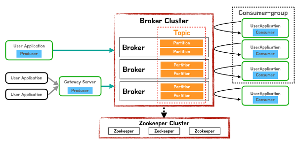
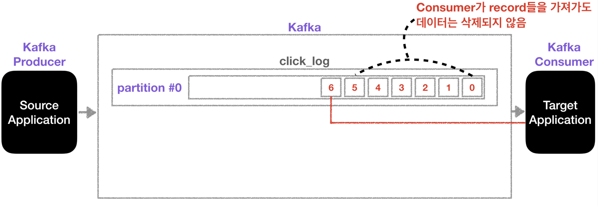
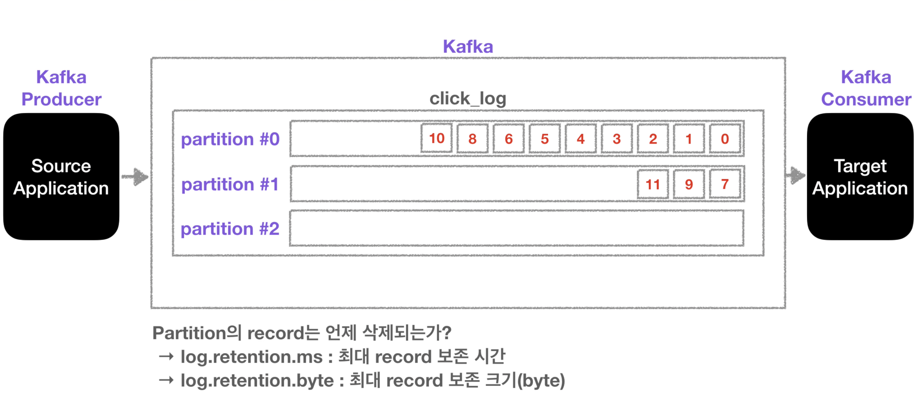
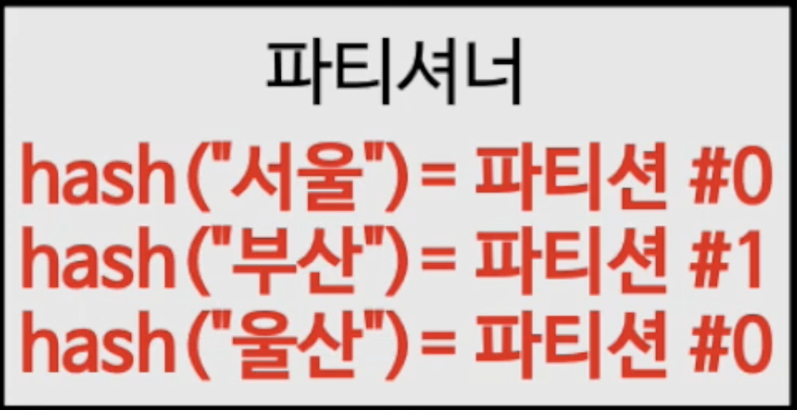
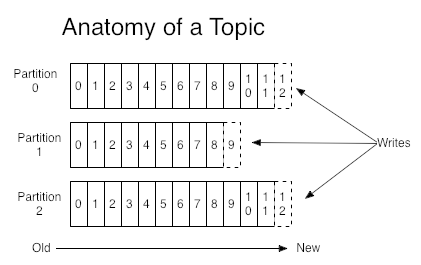

# Apache Kafka
LinkedIn에서 최초로 만들고 opensource화 한 확장성이 뛰어난 분산 메시지 큐(FIFO : First In First Out)
* 분산 아키텍쳐 구성, Fault-tolerance한 architecture(with zookeeper), 데이터 유실 방지를 위한 구성이 잘되어 있음
* AMQP, JMS API를 사용하지 않은 TCP기반 프로토콜 사용
* Pub / Sub 메시징 모델을 채용
* 읽기 / 쓰기 성능을 중시
* Producer가 Batch형태로 broker로 메시지 전송이 가능하여 속도 개선
* 파일 시스템에 메시지를 저장하므로, 데이터의 영속성 보장
* Consume된 메시지를 곧바로 삭제하지 않고 offset을 통한 consumer-group별 개별 consume가능

* 주요 사이트
  + [Kafka website](http://kafka.apache.org/)
  + [Github](https://github.com/apache/kafka)
  + [Kafka contributors](https://github.com/apache/kafka/graphs/contributors)


# Kafka 사용 주요 사례
* LinkedIn : activity streams, operational metrics, data bus(400 nodes, 18k topics, 220B msg/day in May 2014)
* Netflix : real-time monitoring and event processing
* Twitter : as part of their Storm real-time data pipelines
* Spotify : log delivery, Hadoop
* 11번가 : [카프카를 이용한 비동기 주문시스템(카프카 컨슈머 애플리케이션 배포 전략 medium post)](https://medium.com/11st-pe-techblog/%EC%B9%B4%ED%94%84%EC%B9%B4-%EC%BB%A8%EC%8A%88%EB%A8%B8-%EC%95%A0%ED%94%8C%EB%A6%AC%EC%BC%80%EC%9D%B4%EC%85%98-%EB%B0%B0%ED%8F%AC-%EC%A0%84%EB%9E%B5-4cb2c7550a72)

# Kafka Architecture



* Broker : Kafka를 구성하는 각 서버 1대 = 1 broker
* Topic : Data가 저장되는 곳
* Producer : Broker에 data를 write하는 역할
* Consumer : Broker에서 data를 read하는 역할
* Consumer-Group : 메세지 소비자 묶음 단위(n consumers)
Zookeeper : Kafka를 운용하기 위한 Coordination * service(zookeeper 소개)
* Partition : topic이 복사(replicated)되어 나뉘어지는 단위

### Kafka Topic
---

* 데이터베이스 테이블이나, 파일시스템의 폴더와 유사한 성질
* Kafka Producer(가) 데이터를 입력
* Kafka Consumer(가) 데이터를 조회

#### Kafka Inner Topic
---

* 하나의 토픽에는 여러개의 파티션을 구성 가능
* 파티션은 데이터의 입력 순서대로 저장
* 컨슈머는 가장 먼저 들어온 데이터부터 순서대로 데이터를 조회
  + **컨슈머가 데이터를 조회**해도, 파티션에 있는 **데이터는 삭제되지 않는다.**
  + 동일 데이터에 대해서 다른 컨슈머 그룹에서 **처음부터 데이터 조회 가능**
  
* 파티션이 2개 이상일 경우
  
  + 파티션이 여러개라면, 데이터는 `Round-Robin`으로 파티션이 설정되어 저장
  + 파티셔닝을 하는 이유는, 다수의 컨슈머에게 적절하게 데이터를 분배하기 위해
  + <b><span style="color:red">파티션은 자유롭게 늘릴 수 있지만, 삭제는 불가능</span></b>

### Kafka Broker
* 카프카가 설치되어 있는 서버 단위
* 최소 `Broker: 3개` 구성을 권장

  + `Partition: 1`, `Replication(복제): 3` 설정의 카프카
  + `Replication(복제)` 설정은 `Broker` 갯수를 넘을 수 없다.
  + `Leader partition` + `Follwer partition` = `ISR(In-Sync-Replication)`
  + `Producer`로 부터 데이터를 전달 받는것은 `Leader partition` 이 전달받아 저장
  + `Follower partition`은 `Leader partition`이 문제가 생겼을 때, 사용하는 복제판
* `producer`로 부터 `ack 설정` 에 따른 데이터 전달 및 응답확인 설정
  + `ack = 0`
  
    - 프로듀서가 브로커에 데이터를 전달하고, 응답 확인 X
    - 응답을 확인하지 않아, 속도가 가장 빠름
    - 응답을 확인하지 않기 떄문에, 데이터 유실 가능성
  + `ack = 1`
  
    - 프로듀서가 브로커에 데이터를 전달하고 응답을 확인하는 통신
    - 프로듀서가 전달하는 리더파티션에 데이터를 잘 받았는지 응답을 확인
    - 그러나 복제 리플리케이션 파티션에 데이터가 전달됬는지 확인 X
  + `ack = all`
  
    - 프로듀서가 브로커에 데이터를 전달하고, 리더 및 리플리케이션 파티션 모두 응답 확인 방법
    - 모든 파티션에 데이터 전달 유무를 확인하여, 데이터 유실되지 않음
    - 모든 파티션을 확인하기 떄문에 속도가 느리다.

### Kafka Partitioner
프로듀서가 데이터를 보낼 때, 파티셔너를 통해서 브로커에 데이터를 전달

* 프로듀서를 사용할 때, 특정한 파티션을 설정하지 않으면 default: UniformStickyPartitioner 로 설정
  + 메세지 Key가 있을때:
  
    - 메세지를 전달 할 때, Key를 기준으로 해쉬값을 구하여, 이 해쉬값 기준으로 저장되는 파티션을 설정
    - 동일한 메세지 Key를 통해 해쉬값을 구하면, 항상 동일한 파티션에 순서대로 저장(큐 이기 떄문에)
    
  + 메세지 Key가 없을때:
    - 메세지 Key가 없을 경우 RR(Round-Robin) 방식으 분배 저장
    - 프로듀서에서 배치로 모을 수 있는 레코드를 모아서 파티셔너로 데이터 전달(이 방식이 라운드 로빈 방식으로 적용) -> 데이터가 파티션에 적절하게 분배됨

### Kafka Consumer Lag

프로듀서가 넣은 데이터들 마지막 순번의 offset과 컨슈머가 순대대로 읽은 offset 의 차이를 **consumer lag** 이다.
* 해당 토픽에 대한 파이프라인에 대한 컨슈머 or 프로듀서의 상태 파악
* Partition이 여러개라면, `Lag`은 여러개가 있을 수 있다.
  + 그 중에 가장 큰 값을 확인하면, 상태 파악에 더 도움이 된다.
* 컨슈머 단위 `Lag` 을 확인하려면, 컨슈머에서 확인하는 것은 바람직하지 않음
  + 컨슈머에서 장애가 발생해 비정상적으로 종료된다면 더이상 컨슈머 `Lag` 을 측정할 수 없는 위험요소 발생
  + 컨슈머가 개발될 때마다 `Lag` 관리 기능을 추가해야하는 번거로움
+ **효과적으로 모니터링 할 수 있도록 `Burrow` 출시**
  + 독립적으로 카프카 lag 모니터링
  + 멀티 카프카 클러스터 지원
  + Sliding window를 통해 컨슈머의 status 체크
  + Http api 를 제공해 다양한 추가 생태계 조성 가능


# Kafka 데이터 쓰기, 복제, 저장

> Producer는 1개이상의 partition에 나뉘어 데이터를 write한다.
> 상기 partition에 적힌 번호는 각 partition의 offset번호임.

* 각 Topic의 partition은 1개의 Leader Replica + 0개 이상의 follower Replica로 구성
* Leader Replica에 데이터를 write, 다른 broker에 follower replica로 복제
* Topic의 데이터(log) 중 replica 데이터는 log segment라는 파일(disk)에 기록
* 메모리가 남아 있으면 페이지 캐시 사용

# Kafka 데이터 읽기


* Consumer는 Partition단위로 데이터를 병렬로 읽을 수 있음
* 복수의 Consumer로 이루어진 Consumer group을 구성하여 1 topic의 데이터를 분산하여 처리 가능
* Topic partition number >= Consumer Group number 일 경우만 가능
  + (Topic partition number < Consumer Group number일 경우 1개 이상의 consumer는 유휴 상태가 됨)


https://blog.voidmainvoid.net/category/%EB%B9%85%EB%8D%B0%EC%9D%B4%ED%84%B0/Kafka

# Kafka Producer Application(client)
* Topic에 해당하는 메세지 생성
* 특정 Topic으로 데이터를 publish
* 처리 실패/재시도 여부

### Add Dependency

```xml
// maven
<dependency>
    <groupId>org.apache.kafka</groupId>
    <artifactId>kafka-clients</artifactId>
    <version>2.8.0</version>
</dependency>
```
```ruby
// gradle
implementation group: 'org.apache.kafka', name: 'kafka-clients', version: '2.8.0'
```
* 의존성 추가할 때 주의해야할 점은 버전을 잘 확인해야 한다.
* 카프카(broker) 서버 버전과 카프카 클라이언트(producer, consumer) 버전의 호환을 확인해야한다.


# Kafka 환경

### ZooKeeper 설정
* [ZooKeeper 설치](https://twofootdog.tistory.com/89)
* ZooKeeper 환경설정
  /usr/local/zookeeper/conf/zoo.cfg(설치경로) :
  ```ruby
  tickTime=2000
  initLimit=10
  syncLimit=5
  dataDir=/data
  clientPort=2181
  server.1=zk01:2888:3888
  server.2=zk02:2888:3888
  server.3=zk03:2888:3888
  ```
  - tickTime : 주키퍼가 사용하는 시간에 대한 기본 측정 단위(밀리초)
  - initLimit : 팔로워가 리더와 초기에 연결하는 시간에 대한 타임아웃 tick의 수
  - syncLimit : 팔로워가 리더와 동기화 하는 시간에 대한 타임아웃 tick의 수(주키퍼에 저장된 데이터가 크면 더 크게 잡아야 함)
  - dataDir : 주키퍼의 트랜잭션 로그와 스냅샷이 저장되는 저장경로. 이 글에서는 /data로 생성했었기 때문에 zoo.cfg에서도 /data로 지정함
  - clientPort : 주키퍼 사용 TCP 포트
  - server.x : 주키퍼 앙상블 구성을 위한 서버 설정. server.myid 형식으로 사용. 2888:3888은 기본 포트이며, 앙상블 내 노드끼리 연결 & 리더 선출에 사용

* [Linux JVM 메모리 부족 해결](https://gre-eny.tistory.com/177)
* [Kafka 주요 운영 및 설정](https://getto215.github.io/kafka-architecture-2/)
