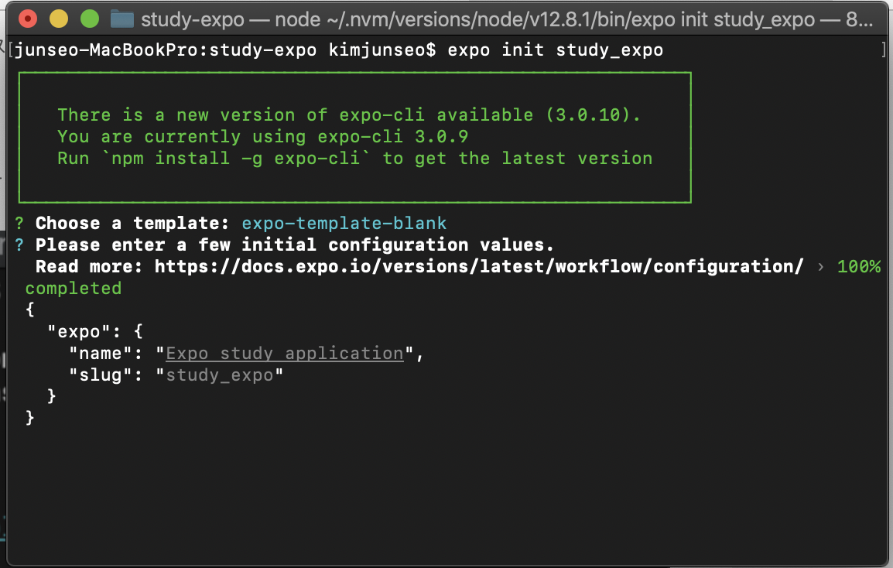
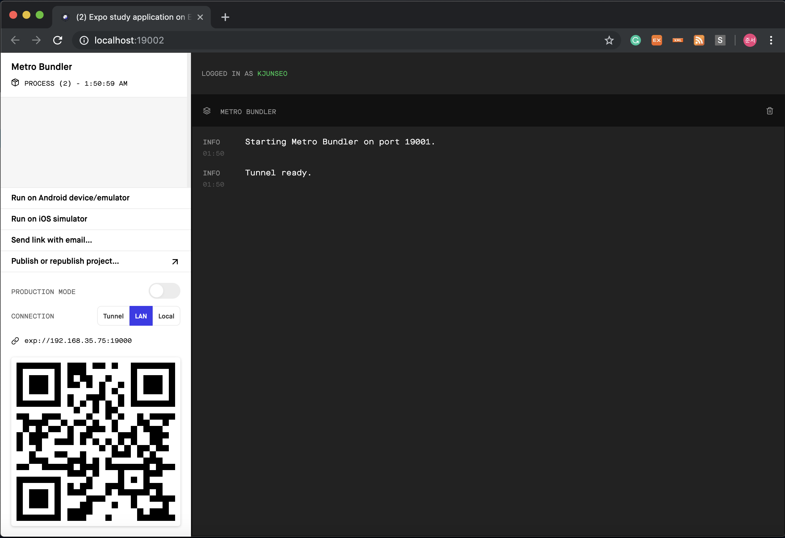

# React Native
Build Native Mobile App using JS and React

* WebView(x)
* Native App(o)
자바스크립트와 리엑트로 웹뷰가 아닌 실제 네이티브 앱을 개발


실제 타켓
브라우저 <-> 네이티브앱
렌더링을 판단해서 각 플랫폼에 맞게 실행


웹뷰로 맵핑된 앱이 아니라, 실제 Native App 개발


자바스크립트 문법으로 네이티브 코드를 작성하면, 브릿지를 통해서 해당 OS가 이해할 수 있는 네이티브 코드로 변환해 준다.


브릿지는 실행 환경에 따라 랜더링이 바뀌며, 브라우져와 App으로 나눈다.
* 브라우저: React JS
* 앱 : React Native


## React Virtual Dom

## Javascript 실행환경

# Expo

[Expo Docs](https://docs.expo.io/get-started/installation/)
쉽게 말해, 리엑트 네이티브 개발을 위한 set-up이 미리 구성되어있으며, natvie파일들을 사용자에게서 숨겨놓고 알아서 관리해주는 툴이다.

### Expo의 장점
* Expo는 개발 시작하기가 간편하다. 리액트 네이티브를 위한 set up이 미리 구성되어있기 때문이다.
* Expo는 배포하기가 매우 편하다. 처음 배포 후, 업데이트 버전은, Expo에 publish만 해주면, Expo가 알아서 업데이트 해준다.

### Expo의 단점
* Expo에서 제공하는 API만 사용가능하다. 필요한 기능이 없을 경우, 모듈을 만들어 사용할 수 없다.
* native 파일들을 크게 제어할 수 없다.

# Expo 프로젝트 환경
* $Node.js$ $10$ $LTS$ 이상 버전
* $npm$ $Version$ $6$ 이상 버전

# Expo CLI 설치
```cmd
npm install -g expo-cli
```

# Expo Join
Expo Cli 설치 후 로그인 여부 확인 및 회원가입

* 로그인 여부 확인
    ```cmd
    expo whoami
    ```
* Expo 회원가입
    ```cmd
    expo register
    ```
* Expo 로그인
    ```cmd
    expo login
    ```


### Expo 프로젝트 생성
```cmd
expo --version # 버전확인 // 설치유무

expo init '프로젝트 명'
```

### Expo 프로젝트 실행 방법
```cmd
cd '프로젝트 명'
npm start       # 프로젝트 실행(==expo start)
```

명령어를 입력하면, template을 선택해 줄 수 있다. 기본으로 blank를 선택해준다.


blank 선택후, app의 이름을 원하는대로 적어주고 엔터를 눌러주면 프로젝트가 생성된다.


만들어진 프로젝트 디렉토리로 이동 후, npm start를 입력하면, 프로젝트가 실행된다.
프로젝트가 실행되면서 자동으로 expo dev tool 웹페이지가 열린다.


