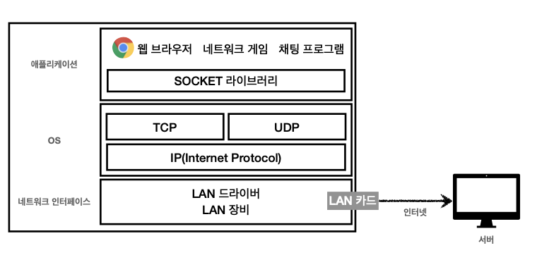
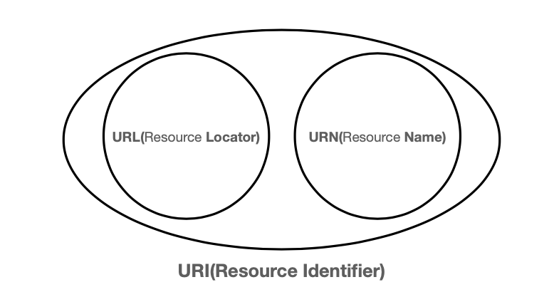
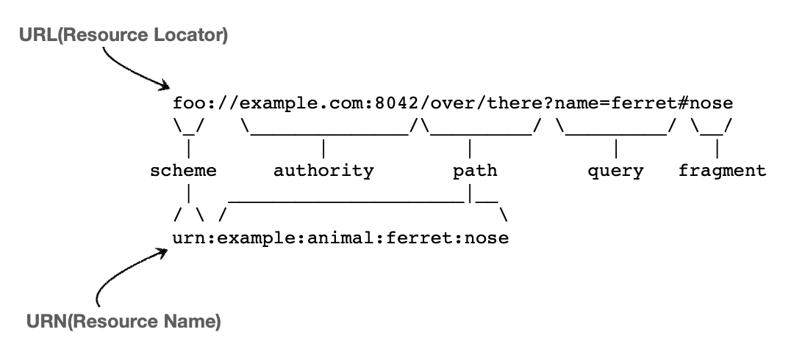
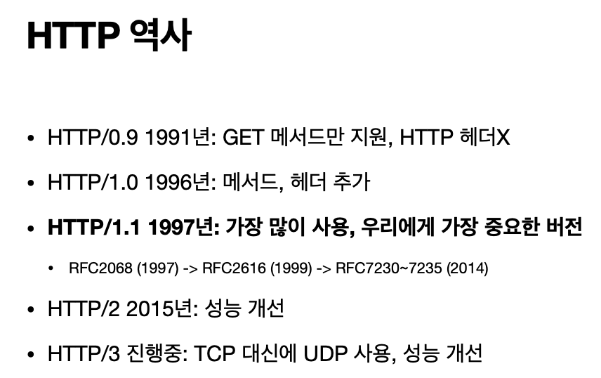

# HTTP

## 인터넷 네트워크

* 인터넷 통신
* IP(Internet Protocol)
  + 지정한 IP 주소에 데이터 전달
  + 패킷(Packet) 단위로 데이터 전달
    - 패킷
    - 요청IP, 응답IP, 전송 데이터로 구성
  + IP 프로토콜의 한계
    - 비연결성: 서버 상태, 서비스 불능
    - 비신뢰성: 패킷 누실, 패킷 순서
    - 프로그램 구분: 같은 IP를 사용하는 서버에서 다양한 어플리케션이 구동중일 경우, 타켓 어플리케이션을 알 수 없다.
* 인터넷 프로토콜 스택 4 계층

  + 어플리케이션 계층: HTTP, HTTPS
  + 전송 계층: TCP / UDP
  + 인터넷 계층: IP
  + 네트워크 인터페이스 계층: LAN Hardware
* TCP(Transmission Control Protocol)
  + 연결 지향: TCP 3 way handshacke(가상연결)
  + 데이터 전달 보증(Request&Response)
  + 순서 보장(신뢰성)
* UPD(User Datagram Protocol)
  + IP, Port, Checksum 기능
  + 나머지는 유저의 어플리케이션에서 설계
  + 속도
* PORT
  + 같은 IP 내에서 프로세스 구분 기준
* DNS(Domain Name System)
  + DNS서버에서 도메인 명으로 IP/Port 정보를 받는다.

## URI
URI: Uniform Resource Identifier



* URL

* scheme
  + 통신 프로토콜 스키마 (HTTP, HTTPS, FTP 등,)
* userinfo
  + URL에 사용자정보를 포함하여 인증
* host
  + 호스트명
  + 도메인명 또는 IP 주소를 직접사용
* port
  + wjqthr vhxm
  + 일반적으로 생략 시 , HTTP:80, HTTPS:443 포트
* path
  + 리소스 경로
  + 계층적 구조
* query
  + key = value 구조
  + `?` 로 시작하며, `&` 추가가능 `ex)` `?keyA=value&keyB=value`
  + 문자형태로 전송되어 쿼리스트링으로 불린다.
* fragment
  + html 내부 북마크 구조로 사용

## HTTP
HTTP(Hyper Text Transfer Protocol)


### HTTP 메세지

HTTP 메세지는 바이트로 이뤄진 모든 데이터를 전송가능
* HTML, TEXT
* IMAGE, VIDEO, VOICE, MUSIC
* JSON, XML(API)
* 거의 모든 형태의 데이터 전송가능
* 서버간의 데이터를 주고 받을 때 대부분 HTTP 사용


---

HTTP(Hypertext Transfer Protocol)는 웹을 개발하는 사람이라면 누구나 다 알아야 하는 통신 프로토콜입니다. 프로토콜이란 상호 간에 정의한 규칙을 의미하며 특정 기기 간에 데이터를 주고받기 위해 정의되었습니다. 통신 프로토콜을 쉽게 풀어보면 “나는 이렇게 줄 테니 넌 이렇게 받고 난 너가 준거 그렇게 받을께” 정도가 되겠네요 :)

웹에서는 브라우저와 서버 간에 데이터를 주고받기 위한 방식으로 HTTP 프로토콜을 사용하고 있으며 따라서 프런트엔드 개발자라면 필수적으로 알아야 하는 지식이 되었습니다.

### HTTP 프로토콜의 특징

HTTP 프로토콜은 상태가 없는(stateless) 프로토콜입니다. 여기서 상태가 없다라는 말은 데이터를 주고 받기 위한 각각의 데이터 요청이 서로 독립적으로 관리가 된다는 말입니다.
좀 더 쉽게 말해서 이전 데이터 요청과 다음 데이터 요청이 서로 관련이 없다는 말이죠.

이러한 특징 덕택에 서버는 세션과 같은 별도의 추가 정보를 관리하지 않아도 되고, 다수의 요청 처리 및 서버의 부하를 줄일 수 있는 성능 상의 이점이 생깁니다.

HTTP 프로토콜은 일반적으로 TCP/IP 통신 위에서 동작하며 기본 포트는 80번입니다.

### HTTP Request & HTTP Response

HTTP 프로토콜로 데이터를 주고받기 위해서는 아래와 같이 요청(Request)을 보내고 응답(Response)을 받아야 합니다.


그리도 요청과 응답을 이해하기 위해서는 먼저 클라이언트(Client)와 서버(Server)를 이해해야 합니다.
클라이언트란 요청을 보내는 쪽을 의미하며 일반적으로 웹 관점에서는 브라우져를 위미합니다. 서버란 요청을 받는 쪽을 의미하며, 일반적으로 데이터를 보내주는 원격지의 컴퓨터를 의미합니다.

### URL

URL(Uniform Resource Locators)은 개발자가 아니더라도 이미 우리에게 익숙한 용어 입니다. 서버에 자원을 요청하기 위해 입력하는 영문 주소입니다. 아무래도 숫자로 되어 있는 IP 주소보다는 훨씬 기억하기 쉽기 떄문에 사용합니다.

URL 구조는 아래와 같습니다.


### HTTP 요청 메서드

위에서 살펴본 URL을 이용하면 서버에 특정 데이터를 요청할 수 있습니다. 여기서 요청하는 데이터에 특정 동작을 수행하고 싶으면 어떻게 해야 할까요?

바로 HTTP 요청 메서드(Http Request Methods)를 이용합니다.
일반적으로 HTTP요청 메서드는 HTTP Verbs라고도 불리우며 아래와 같이 주요 메서드를 갖고 있습니다.

* GET     : 존재하는 자원에 대한 요청
* POST    : 새로운 자원을 생성
* PUT     : 존재하는 자원에 대한 변경
* DELETE  : 존재하는 자원에 대한 삭제

이와 같이 데이터에 대한 조회, 생성, 변경, 삭제 동작을 HTTP 요청 메서드로 정의할 수 있습니다. 참고로 때에 따라서는 POST 메서드로 PUT, DELETE의 동작도 수행할 수 있습니다.

기타 요청 메서드는 다음과 같습니다.
* HEAD    : 서버 헤더 정보를 획득, GET과 비슷하거나 Response Body를 반환하지 않음
* OPTIONS : 서버 옵션들을 확인하기 위한 요청, CORS에서 사용


### HTTP 상태 코드

앞에서 살펴본 URL과 요청 메서드가 클라이언트에 설정해야 할 정보라면 HTTP 상태 코드(HTTP Status Code)는 서버에서 설정해주는 응답(Response) 정보입니다.

프런트엔드 개발자 입장에서는 더욱이 중요한 이유가 이 상태 코드로 에러 처리를 할 수 있기 때문입니다. 간단한 예시를 들어 아래와 같이 사용자 목록을 받아오는 GET 메서드 요청을 날려보겠습니다.

```code
http://domain.com/users
```

위 요청을 보내고 나면 서버에서 응답으로 오는 상태 코드가 크게 2개로 나뉩니다. 200(성공)과 404(실패)입니다. 따라서, 이 HTTP 상태 코드로 추가적인 로직을 구현할 수 있죠.

주요 상태 코드는 200번대부터 500번대까지 다양하게 있지만 주요한 상태 코드만 몇 개 살펴보겠습니다.


### 2xx - 성공

200번대의 상태 코드는 대부분 성공을 의미합니다.

* 200 : GET 요청에 대한 성공
* 204 : No Content. 성공했으나 응답 본문에 데이터가 없음
* 205 : Reset Content. 성공했으나 클라이언트의 화면을 새로 고침하도록 권고
* 206 : Partial Conent. 성공했으나 일부 범위의 데이터만 반환

### 3xx - 리다이렉션

300번대의 상태 코드는 대부분 클라이언트가 이전 주소로 데이터를 요청하여 서버에서 새 URL로 리다이렉트를 유도하는 경우입니다.

* 301 : Moved Permanently, 요청한 자원이 새 URL에 존재
* 303 : See Other, 요청한 자원이 임시 주소에 존재
* 304 : Not Modified, 요청한 자원이 변경되지 않았으므로 클라이언트에서 캐싱된 자원을 사용하도록 권고. ETag와 같은 정보를 활용하여 변경 여부를 확인

### 4xx - 클라이언트 에러

400번대 상태 코드는 대부분 클라이언트의 코드가 잘못된 경우입니다. 유효하지 않은 자원을 요청했거나 요청이나 권한이 잘못된 경우 발생합니다. 가장 익숙한 상태 코드는 404 코드입니다. 요청한 자원이 서버에 없다는 의미죠.

* 400 : Bad Request, 잘못된 요청
* 401 : Unauthorized, 권한 없이 요청. Authorization 헤더가 잘못된 경우
* 403 : Forbidden, 서버에서 해당 자원에 대해 접근 금지
* 404 : Not Found, 서버에 자원이 없는 경우
* 405 : Method Not Allowed, 허용되지 않은 요청 메서드
* 409 : Conflict, 최신 자원이 아닌데 업데이트하는 경우. ex) 파일 업로드 시 버전 충돌

### 5xx - 서버 에러

500번대 상태 코드는 서버 쪽에서 오류가 난 경우입니다.

* 501 : Not Implemented, 요청한 동작에 대해 서버가 수행할 수 없는 경우
* 503 : Service Unavailable, 서버가 과부하 또는 유지 보수로 내려간 경우

### 다시 살펴보는 HTTP 요청과 응답

위에서 배운 URL, 요청 메서드, 상태 코드를 조합하면 아래와 같은 구조가 나옵니다.


