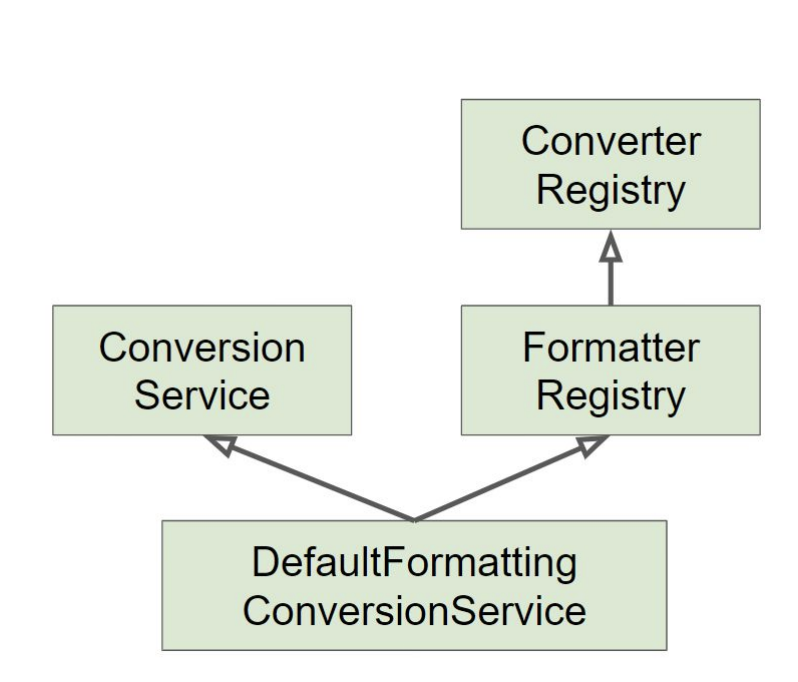
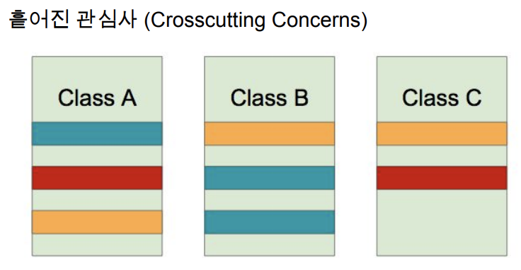
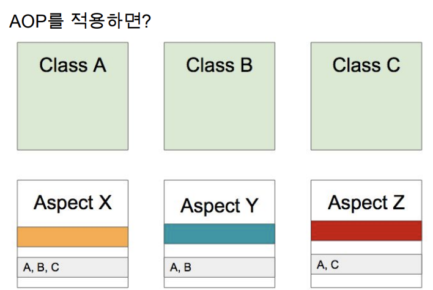
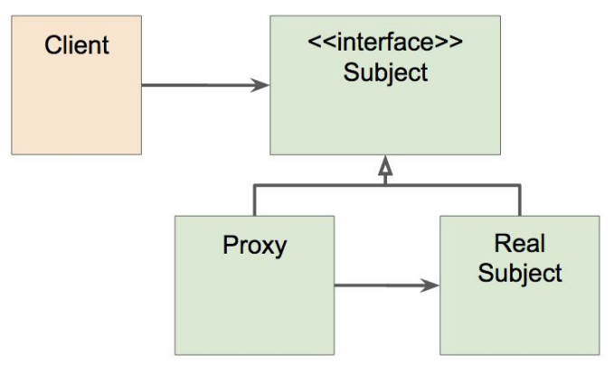

# Spring
CS지식 및 면접 준비로 Spring 관련한 키워드 정리

* [Srping IoC](#ioc)
* [Bean](#bean)
* [Application Context](#application-context)
* [Autowired](#autowired)
* [Dependency Injection](#dependency-injection)
  - [Application Event](#application-event)
  - [Resource Loader](#resource-loader)
  - [Profile](#profile)
  - [Property](#property)
* [Validation](#validation)
* [DataBinding](#databinding)
  - [Converter](#converter)
  - [Formatter](#formatter)
  - [ConversionService](#conversion-service)
* [SpEL](#spel)
* [Spring AOP](#aop)
* [Proxy](#proxy)
* [Null safety](#null-safety)

## IoC
IoC : Inversion of Control

+ IoC Container -> ApplicationContext -> BeanFactory
  - [Application Context](#application-context)
+ 역활
  - Application의 Component 중앙 저장소(@Bean 저장소)
  - @Bean 인스턴스 생성 및 의존 관계 설정
  - @Bean 설정 소스 부터 @Bean 정의를 참조하여 @Bean 을 구성하고 제공
+ 특징
  - 싱글톤 scope으로 빈을 등록하여 프로세스 관리(멀티쓰레드 환경에서 싱글톤 Scope으로 객체를 관리 및 의존성 주입)
  - `<->` 프로토타입은 싱글톤이 아닌 매번 다른 객체를 생성하는 @Bean
+ @Autowired
  - [Autowired](#autowired)

## Bean
[Spring IoC Container](#ioc) 가 관리하는 객체 인스턴스
+ 역활
  - 의존성 관리 `ex) @Mock Test`
  - 라이프 사이클 인터페이스를 통해 관여 가능
+ 등록
  - @ComponentScan: Application이 최초 로드 될때, @ComponentScan 을 통해 @Component로 등록된 객체를 등록
    * 특정 패키지 이하의 모든 클래스 중에 @Component 클래스를 @Bean 으로 자동 등록
    * @Component 객체: 어노테이션으로 등록(@Controller, @Service, @Repository ...)
+ 생존주기(스코프)
  - 싱글톤: 하나의 인스턴스
    * 멀티스레드 환경에서, 프로퍼티를 공유하면 안됨
    * Application 초기 구동시 인스턴스가 생성
  - 프로토타입: 매번 다른 인스턴스
    * Request
    * Session
    * WebSocket
+ 참조: 프로토타입 @Bean이 싱글톤 @Bean을 참조
  - 계속 같은 싱글톤 인스턴스이기 떄문에 문제 없음
+ 참조: 싱글톤 @Bean이 프로토타입 @Bean을 참조
  - 아무런 설정을 하지 않는다면, 변하지 않는 프로토타입 @Bean
  - 클래스 기반 [Proxy패턴](#proxy) @Bean으로 등록하여 매번 다른 프로토타입 인스턴스 객체를 가져온다.
    
  - 업데이트 설정
    * scoped-Proxy
    * Object-Provider
    * Provider(Default)
+ 라이프사이클 인터페이스
  - @BeanPostProcessor: @Bean 인스턴스 생성(@ComponentScan) 후 생성된 빈의 라이프사이클을 관리하는 @BeanPostProcessor에 등록 -> 빈의 라이프사이클 관리

> CG 라이브러리 기반 Proxy

## Application Context
[Interface ApplicationContext](https://docs.spring.io/spring-framework/docs/5.0.8.RELEASE/javadoc-api/org/springframework/context/ApplicationContext.html) : BeanFactory, [EnviromentCapable](https://docs.spring.io/spring-framework/docs/current/javadoc-api/org/springframework/core/env/EnvironmentCapable.html) , MessageSource 등을 상속하는 인터페이스
+ 기능
  - 메세지 소스 처리 기능(i18n)
    * i18n: 언어 국제화 기능
  - 이벤트 발행 기능
    * [ApplicationEventPublisher](#application-event-publisher)
  - 리소스 로딩 기능
    * [ResourceLoader](#resource-loader)
  - Enviroment 기능
    * 프로파일과 프로퍼티를 다루는 인터페이스
    * [프로파일 설정 기능](#profile)
    * [프로퍼티 설정 및 값 가져오기](#property)
+ 설정
  - ClassPathXmlApplicationContext (XML)
  - AnnotationConfigApplicationContext (Java)


## Autowired
@Autowired: 필요한 의존 객체의 타입에 해당하는 @Bean을 찾아 [의존성 주입(Dependency Injection)](#dependency-injection)

+ 의존성 주입 방법
  - Constructor(Spring 4.3 부터 @Autowired 생략가능)
    * 생성자 DI 장점: 필수적으로 사용해야하는 레퍼런스 없이는 인스턴스를 생성 할 수 없도록 강제하는 방법
    * 생성자 DI 단점: 순환 참조가 발생하여 에러가 발생 할 수 있다.
  - Setter
  - Filedm
+ 같은 타입의 빈이 여러개 일때
  - **@Primary**
  - Qualifier: 빈 이름으로 주입(빈 이름을 String으로 입력해야해서, not type safe)
+ 동작원리
  - Application 최초 로딩 시, [모든 @Bean을 등록](#bean)을 하고(@ComponentScan), [의존성 주입(Dependency Injection)](#dependency-injection)한다.
  - BeanPostProcessor: 새로 만든 빈 인스턴스를 수정할 수 있는 라이프 사이클 인터페이스
  - AutowiredAnnotationBeanPostProcessor

## Dependency Injection

### Application Event Publisher
[옵저버 패턴](https://en.wikipedia.org/wiki/Observer_pattern)의 구현체로, 이벤트 프로그래밍에 필요한 인터페이스 제공

+ 설명
  - 정의한 이벤트가 발생하면, 이벤트 핸들러에 의해 이벤트를 처리하는 구조
  - Event 기반 프로그래밍으로, Spring에 의존하지 않고, POJO 기반(Spring에 종속하지 않고 Native Java) 프로그래밍
+ 대상
  - EventHandler 타입 서비스
  - WebSocket
+ 이벤트 발생
  - ApplicationEventPublisher.publishEvent();
+ 이벤트 처리 방법
  - @EventListener 빈 메서드 등록하여 사용
  - 기본적으로 synchronized
    * 순서를 사용하러면, @Order 사용
    * 비동기적으로 사용하려면 @Async or @EnableAsync 사용
+ 스프링이 제공하는 기본 이벤트
  - `ContextRefreshedEvent`: ApplicationContext를 초기화 했더나 리프래시 했을 때 발생.
  - `ContextStartedEvent`: ApplicationContext를 start()하여 라이프사이클 빈들이 시작 신호를 받은 시점에 발생.
  - `ContextStoppedEvent`: ApplicationContext를 stop()하여 라이프사이클 빈들이 정지 신호를 받은 시점에 발생.
  - `ContextClosedEvent`: ApplicationContext를 close()하여 싱글톤 빈 소멸되는 시점에 발생.
  - `RequestHandledEvent`: HTTP 요청을 처리했을 때 발생.

### Resource Loader
[Resource(org.springframework.core.io.Resource) 추상화 인터페이스](https://docs.spring.io/spring-framework/docs/current/javadoc-api/org/springframework/core/io/Resource.html)

+ 특징
  - java.net.URL 을 추상화 인터페이스
  - 스프링 내부에서 많이 사용하는 인터페이스
+ 추상화 이유
  - 클래스패스 기준으로 리소스 읽어오는 기능 부재
  - ServletContext 기준으로 상대 경로로 읽어오는 기능 부재
  - 새로운 핸들러를 등록하여, 특별한 URL 접미사를 만들어 사용할 수 있지만 구현이 복잡하고 편의성 메서드가 부족
+ 주요 메서드
  - getInputStream()
  - exist()
  - isOpen()
  - getDescription(): 전체 경로 포함한 파일 이름 또는 실제 URL
+ 구현체
  - 인터페이스를 상속 받는 구현 클래스
  - UrlResource: [java.net.URL 참고](https://docs.oracle.com/javase/7/docs/api/java/net/URL.html), 지원 프로토콜: http, https, ftp, file, jar
  - ClassPathResource: 지원하는 접두어 classpath:
  - FileSystemResource
  - ServletContextResource: 웹 어플리케이션 루트에서 상대 경로로 리소스 탐색  
+ 리소스 읽어오기
  - Resource 타입은 location 문자열과 ApplicationContext의 타입에 의해 결정
    * ClassPathXmlApplicationContext -> ClassPathResource
    * FileSystemXmlApplicationContext -> FileSystemResource
    * WebApplicationContext -> ServletContextResource
  - **ApplicationContext의 타입에 상관없이 리소스 타입을 강제하려면 java.net.URL 접두어(+ classpath:)중 하나를 사용**
    * classpath:me/whiteship/config.xml -> ClassPathResource
    * file:///some/resource/path/config.xml -> FileSystemResource
  - URL로 읽어오기
  - 파일 시스템에서 읽어오기
  - 클래스패스에서 읽어오기
  - 상대/절대 경로로 읽어오기

### Profile
빈들의 그룹화 설정

+ 설명
  - 빈들의 그룹
  - [Enviroment](https://docs.spring.io/spring-framework/docs/current/javadoc-api/org/springframework/core/env/Environment.html)의 역활은 활성화할 프로파일 확인 및 설정
  - `ex)` 테스트 환경에서는 `A` @Bean 을 사용하고, 배포 환경에서는 `B` @Bean 사용 등, 환경에 따라 사용하는 빈이 다를때
  - `ex)` 모니러팅 용 @Bean 은 테스트할 때 필요가 없고, 배포 환경에서만 필요할때
+ 프로파일 정의
  - 클래스에 정의
    * @Configuration @Profile ("test")
    * @Component @Profile ("test")
  - 메소드에 정의
    * @Bean @Profile ("test")
+ 프로파일 설정 및 적용
  - IDE Bulid Configuration Setting
      * -Dspring.profile.active="test,A,B..."
      * @ActiveProfiles (테스트용)
+ 프로파일 표현식 사용 가능
  - !
  - &
  - |

### Property
다양한 방법으로 정의할 수 있는 설정 값

+ 설명
  - [Enviroment](https://docs.spring.io/spring-framework/docs/current/javadoc-api/org/springframework/core/env/Environment.html)의 역활은 프로퍼티 소스 설정 및 프로퍼티 값 가져오기
+ 사용
  - @PropertySource
    * Enviroment를 통해 프로퍼티 추가하는 방법
+ 프로퍼티 우선순위
  - StandardServletEnvironment
    * ServletConfig 매개변수
    * ServletContext 매개변수
    * JNDI (java:comp/env/)
    * JVM 시스템 프로퍼티 (-Dkey=”value”)
    * JVM 시스템 환경 변수 (운영 체제 환경 변수)

## Validation
[애플리케이션에서 사용하는 객체 검증용 인터페이스(org.springframework.validation)](https://docs.spring.io/spring-framework/docs/current/javadoc-api/org/springframework/validation/Validator.html)

+ 특징
  - 어떠한 계층과도 관계가 없다 -> 모든계층(웹, 서비스, 데이터, 모메인)에서 사용
  - DataBinder에 들어가 바인딩 할 떄 같이 사용
+ 인터페이스
  - boolean supports(Class class): 어떤 타입의 객체를 검증할 떄 사용할 것인지 결정
  - void validate(Object obj, Error e): 실제 검증 로직을 구현
+ 스프링부터 2.0.5 이상
  - LocalValidatorFactoryBean 빈으로 자동 등록

## DataBinding
[데이터 바인딩 추상화 인터페이스(org.springframework.validation)](https://docs.spring.io/spring-framework/docs/current/javadoc-api/org/springframework/validation/DataBinder.html)

+ 관점
  - 기술적 관점: 프로퍼티 값을 타겟 객체에 설정하는 기능
  - 사용자 관점: 사용자 입려값을 애플리케이션 도메인 모델에 동적으로 변환해 넣어주는 기능
  - 해석: 스프링에서 유저 입력값은 대부분 '문자열', 그 값을 객체가 가지고 있는 타입(프리미티브, 레퍼런스) 또는 도메인 타입으로 변환해서 넣어주는 기능
* 종류
  - [Converter](#converter)
  - [Formatter](#formatter)
  - [ConversionService](#conversion-service)

### Converter
[Converter](https://docs.spring.io/spring-framework/docs/current/javadoc-api/org/springframework/core/convert/converter/Converter.html)

+ 특징
  - S 타입을 T 타입으로 변환할 수 있는 변환기(Converter)
  - 상태 정보 없음 == `State less` == 쓰레드 세이프
  - [ConverterRegistry](https://docs.spring.io/spring-framework/docs/current/javadoc-api/org/springframework/core/convert/converter/ConverterRegistry.html) 에 등록해서 사용
  ```java
  public class StringToEventConverter implements Converter<String, Event> {
    @Override
    public Event convert(String source) {
      Event event = new Event();
      event.setId(Integer.parseInt(source));
      return event;
    }
  }
  ```

### Formatter
[Formatter](https://docs.spring.io/spring-framework/docs/current/javadoc-api/org/springframework/format/Formatter.html)

+ 특징
  - PropertyEditor 대체제
  - Object와 String 간의 변환을 담당
  - 문자열을 Locale에 따라 다국화(i18n)하는 기능도 제공(optional)
  - [FormatterRegistry](https://docs.spring.io/spring-framework/docs/current/javadoc-api/org/springframework/format/FormatterRegistry.html) 에 등록하여 사용
  ```java
  public class EventFormatter implements Formatter<Event> {
    @Override
    public Event parse(String text, Locale locale) throws ParseException {
      Event event = new Event();
      int id = Integer.parseInt(text);
      event.setId(id);
      return event;
    }
    @Override
    public String print(Event object, Locale locale) {
      return object.getId().toString();
    }
  }
  ```

### Conversion Service
[ConversionService(org.springframework.core.convert)](https://docs.spring.io/spring-framework/docs/current/javadoc-api/org/springframework/core/convert/ConversionService.html)

+ 특징
  - 실제 변환 작업은 이 인터페이스를 통해서 쓰레드-세이프하게 사용 가능
  - 스프링MVC, 빈 설정, SpEL에서 사용
  - DefaultFormattingConversionService
    * FormatterRegistry
    * ConversionService
    * 여러 기본 컨버터와 포매터 등록
+ 스프링 부트 경우
  - 웹 애플리케이션인 경우 DefaultFormattingConversionService를 상속해서 만든 WebConverionService를 빈으로 자동 등록
  - Formatter 와 Converter 빈을 찾아 자동으로 등록
  

## SpEL
SpEL: Spring Expression Langugae

+ 설명
  - 객체 그래프를 조회하고 조작하는 기능 제공
  - [Unified EL](https://docs.oracle.com/javaee/5/tutorial/doc/bnahq.html)과 비슷하지만, 메소드 호출을 지원하며, 문자열 템플릿 기능 제공
  - OGNL, MVEL, JBOss EL 등 자바에서 사용할 수 있는 여러 EL이 있지만, SpEL은 모든 스프링 프로젝트 전반에 걸쳐 사용할 EL로 제작
+ SpEL 구성
  - ExpressionParser parser = new SpelExpressionParser()
  - StandardEvaluationContext context = new StandardEvaluationContext(bean)
  - Expression expression = parser.parseExpression(“SpEL 표현식”)
  - String value = expression.getvalue(context, String.class)
+ 문법
  - `#{“표현식"}`
  - `${“프로퍼티"}`
  - 표현식은 프로퍼티를 가질 수 있지만, 반대는 안 됨.
    * #{${my.data} + 1}
  - [레퍼런스 참고](https://docs.spring.io/spring/docs/current/spring-framework-reference/core.html#expressions-language-ref)
+ 실제로 어디서 쓰나?
  - @Value 애노테이션
  - @ConditionalOnExpression 애노테이션
  - [스프링 시큐리티](https://docs.spring.io/spring-security/site/docs/3.0.x/reference/el-access.html)
    * 메소드 시큐리티, @PreAuthorize, @PostAuthorize, @PreFilter, @PostFilter
    * XML 인터셉터 URL 설정
  - [스프링 데이터](https://spring.io/blog/2014/07/15/spel-support-in-spring-data-jpa-query-definitions)
    * @Query 애노테이션
  - [Thymeleaf](https://blog.outsider.ne.kr/997)


## AOP
Spring AOP(Aspect Oriendted Programming): OOP를 보완하는 수단으로 모듈화 할 수 있는 프로그래밍 기법

> [Filter, Intercepter AOP 차이](spring-filter-interceopter-aop.md)




+ AOP 주요 개념
  - Aspect, Target: 적용이 되는 대상
  - Adive: 해야하는 작업
  - Join point, PointCut: 적용하는 위치(`ex) 생성자 호출, 메서드 실행 전 or 후...`)
+ AOP 구현체
  - AspectJ(Native Java)
  - Spring AOP
+ AOP 적용 방법
  - 컴파일(AspectJ): 컴파일 시 Java -> class 파일(바이트 코드로 변환)로 변환 할 떄
  - 로드타임: 로드 시 바이트 코드를 JVM에 로딩할 때
  - 런타임(Srping AOP): 어플리케이션을 최초 구동 할 때
    + Spring 구동: 빈을 생성할 때 -> 빈을 감쌓는 Proxy빈을 생성(Aspect를 넣어서)
+ 프록시 기반 AOP
  - Spring AOP
  - 프록시 기반의 AOP 구현체
  - 스프링 빈에만 AOP를 적용 가능
  - 모든 AOP 기능을 제공하는 것이 목적이 아니라, 스프링 IoC와 연동하여 엔터프라이즈 애플리케이션에서 가장 흔한 문제에 대한 해결책을 제공하는것이 목적
+ @AOP 구현
  - Spring AOP 의존성 추가
  ```xml
  <dependency>
    <groupId>org.springframework.boot</groupId>
    <artifactId>spring-boot-starter-aop</artifactId>
  </dependency>
  ```
  - AOP 주요 개념 3가지 구현
    * Aspect
    * PointCut
    * Advice
  - @Aspect
    * 빈으로 등록해야 함(@Component 추가)
  - @PointCut
    * 3가지 표현방법
      1. execution: 정규식으로 패키지 위치나, 클래스, 메소드 별 적용
      2. **@annotaion: 유저 어노테이션을 생성하여, 원하는 위치에 어노테이션 선언**
        + Retentaion 설정: class 까지
      3. bean: 등록되 있는 빈들 중에 원하는 빈에 적용
  - @Advice
    * 적용된 AOP 빈들이 해야하는 작업
    * @Before: 빈이 실행되기 전에
    * @AfterReturning: 빈이 실행된 후
    * @AfterThrowing: 빈 에러가 난 후
    * @Around: 빈을 감싸는 전체 범위(모든 경우의 수를 포함한다.) -> 빈 생성 전, 후 등

### Proxy
프록시 패턴: (기존 코드 변경 없이) 접근 제어 또는 부가 기능 추가


+ 예시
  - `ex) 기존 코드를 변경하지 않고, 성능 측정 기눙 추가(프록시 패턴으로)`
+ 문제점
  - 매번 프록시 클래스를 작성해야 한다.
  - 여러 클래스에, 여러 메소드에 적용하려면?
  - 객체들 간의 복잡한 이해 관계도
+ 대안: Spring AOP
  - 스프링 IoC 컨테이너가 제공하는 기반 시설가 Dynamic 프록시를 사용하여 복잡한 문제 해결
  - 동적 프록시: 동적으로 프록시 객체 생성 방법
    * 자바가 제공하는 방법은 인터페이스 기반 프록시 생성
    * CGlib은 클래스 기반 프록시도 지원
  - 스프링 IoC: 기존 빈을 대체하는 동적 Proxy 빈을 만들어 등록
    * 클라이언트 코드 변경 X
    * AbstractAutoProxyCreator implements BeanPostProcessor

## Null safety
스프링 프레임워크5에 추가된 Null 관련 어노테이션

+ 적용
  - @NonNull: 널 불가
  - @Nullable: 널 가능
  - @NonNullApi (패키지 전체 레벨 설정): 널 불가
  - @NonNullFields (패키지 전체 레벨 설정): 널 가능
+ 목적
  - 컴파일 시점에 최대한 NullPointException을 방기하기 위해
