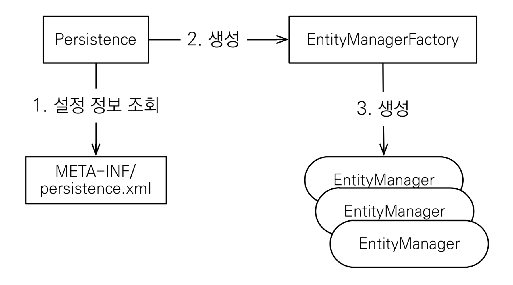

# JPA

JPA에서 가장 중요한 2가지
1. 객체와 관계형 데이터베이스 매핑(ORM)
2. [영속성 컨텍스트](jpa-persistence-context.md)

* JPA는 특정 데이터베이스 종속 X
  + 데이터베이스 방언의 유동적인 처리(번역)
  + Hibernate는 약 40가지의 DB 방언을 처리 가능  
* JPA는 기본적으로 동적으로 생성(리플렉션)으로 관리되기 떄문에, 기본 생성자가 반드시 필요
  ```java
  // 기본 생성자, 접근제어자는 자유롭게 설정가능
  public Member() {

  }
  ```

> 데이터베이스 방언
각각의 데이터베이스가 제공하는 SQL문법과 함수는 조금씩 차이가 있다.
즉 SQL 표준을 지키지 않는 특정 데이터베이스만의 고유한 기능
> * 가변문자
>   * MySQL: VARCHAR
>   * Oracle: VARCHAR2
> * 문자열을 자르는 함수
>   * MySQL: SUBSTRING()
>   * Oracle: SUBSTR()
> * 페이징
>   * MySQL: LIMIT
>   * Oracle: ROWNUM

## JPA 기본 구조



* Persistence 설정으로 DB에 대한 EntityManagerFactory 생성
* 어플리케이션에서 설정된 DB에 맵핑되는 EntityMangerFactory 단 한개만 존재.
* 여러 클라이언트를 통해 들어오는 요청을 처리하기 위해, EntityManagerFactory에서 EntityManager 를 생성


## JPQL
* 테이블이 아닌 객체를 대상으로 검색하는 객체 지향 쿼리
* SQL을 추상화한 쿼리


## H2 DB

장점
* 실습용 DB
* Web에서 Console 환경 제공(Web에서 콘솔 환경으로 쿼리 실행 가능)
* MySQL, Oracle 유사한 쿼리 시뮬레이션 가능
* 시퀀스, AUTO INCREMENT 기능 지원
* 메모리 DB
