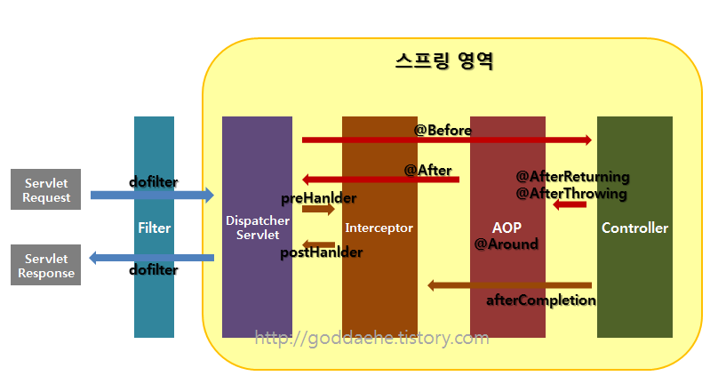

# Filter Intercepter AOP 정리

개발을 하다보면, 공통적으로 처리해야 할 업무들이 많다.

> 공통 프로세스에 대한 고민

예를들어 로그인 관련(세션체크)처리, 권한체크, XSS(Cross site script)방어, pc와 모바일웹의 분기처리, 로그, 페이지 인코딩 변환 등이 있다.

공통업무에 관련된 코드를 모든 페이지 마다 작성 해야한다면 중복된 코드가 많아지게 되고 프로젝트 단위가 커질수록 서버에 부하를 줄 수도있으며, 소스 관리도 되지 않는다.

<u><q><b><i>즉, 공통 부분은 따로 빼서 관리하는게 좋다.</i></b></q></u>

스프링에서 사용되는 Filter, Interceptor, AOP 세 가지 기능은 모두 무슨 행동을 하기전에 먼저 실행하거나, 실행한 후에 추가적인 행동을 할 때 사용되는 기능들이다.

* Interceptor와 Filter는 Servlet 단위에서 실행된다. <> 반면 AOP는 메소드 앞에 Proxy패턴의 형태로 실행된다.

* 실행순서를 보면 Filter가 가장 밖에 있고 그안에 Interceptor, 그안에 AOP가 있는 형태이다.

따라서 요청이 들어오면 Filter → Interceptor → AOP → Interceptor → Filter 순으로 거치게 된다.
