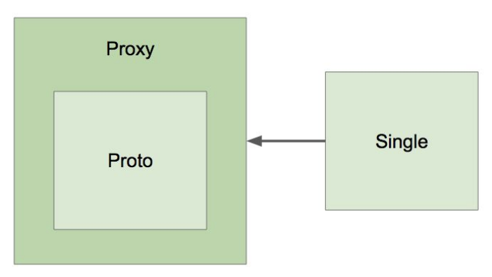

# Spring
CS지식 및 면접 준비로 Spring 관련한 키워드 정리

* [Srping IoC](#ioc)

## IoC
IoC : Inversion of Control

+ IoC Container -> ApplicationContext -> BeanFactory
  - [Application Context](#application-context)
+ 역활
  - Application의 Component 중앙 저장소(@Bean 저장소)
  - @Bean 인스턴스 생성 및 의존 관계 설정
  - @Bean 설정 소스 부터 @Bean 정의를 참조하여 @Bean 을 구성하고 제공
+ 특징
  - 싱글톤 scope으로 빈을 등록하여 프로세스 관리(멀티쓰레드 환경에서 싱글톤 Scope으로 객체를 관리 및 의존성 주입)
  - `<->` 프로토타입은 싱글톤이 아닌 매번 다른 객체를 생성하는 @Bean
+ @Autowired
  - [Autowired](#autowired)

## Bean
[Spring IoC Container](#ioc) 가 관리하는 객체 인스턴스
+ 역활
  - 의존성 관리 `ex) @Mock Test`
  - 라이프 사이클 인터페이스를 통해 관여 가능
+ 등록
  - @ComponentScan: Application이 최초 로드 될때, @ComponentScan 을 통해 @Component로 등록된 객체를 등록
    * 특정 패키지 이하의 모든 클래스 중에 @Component 클래스를 @Bean 으로 자동 등록
    * @Component 객체: 어노테이션으로 등록(@Controller, @Service, @Repository ...)
+ 생존주기(스코프)
  - 싱글톤: 하나의 인스턴스
    * 멀티스레드 환경에서, 프로퍼티를 공유하면 안됨
    * Application 초기 구동시 인스턴스가 생성
  - 프로토타입: 매번 다른 인스턴스
    * Request
    * Session
    * WebSocket
+ 참조: 프로토타입 @Bean이 싱글톤 @Bean을 참조
  - 계속 같은 싱글톤 인스턴스이기 떄문에 문제 없음
+ 참조: 싱글톤 @Bean이 프로토타입 @Bean을 참조
  - 아무런 설정을 하지 않는다면, 변하지 않는 프로토타입 @Bean
  - 클래스 기반 [Proxy패턴](#proxy) @Bean으로 등록하여 매번 다른 프로토타입 인스턴스 객체를 가져온다.
    
  - 업데이트 설정
    * scoped-Proxy
    * Object-Provider
    * Provider(Default)
+ 라이프사이클 인터페이스

> CG 라이브러리 기반 Proxy

## Application Context
[Interface ApplicationContext](https://docs.spring.io/spring-framework/docs/5.0.8.RELEASE/javadoc-api/org/springframework/context/ApplicationContext.html) : BeanFactory, [EnviromentCapable](https://docs.spring.io/spring-framework/docs/current/javadoc-api/org/springframework/core/env/EnvironmentCapable.html) , MessageSource 등을 상속하는 인터페이스
+ 기능
  - 메세지 소스 처리 기능(i18n)
    * i18n: 언어 국제화 기능
  - 이벤트 발행 기능
    * [ApplicationEventPublisher](#application-event-publisher)
  - 리소스 로딩 기능
    * [ResourceLoader](#resource-loader)
  - Enviroment 기능
    * 프로파일과 프로퍼티를 다루는 인터페이스
    * [프로파일 설정 기능](#profile)
    * [프로퍼티 설정 및 값 가져오기](#property)
+ 설정
  - ClassPathXmlApplicationContext (XML)
  - AnnotationConfigApplicationContext (Java)

## Autowired
@Autowired: 필요한 의존 객체의 타입에 해당하는 @Bean을 찾아 [의존성 주입(Dependency Injection)](#dependency-injection)

+ 의존성 주입 방법
  - Constructor(Spring 4.3 부터 @Autowired 생략가능)
    * 생성자 DI 장점: 필수적으로 사용해야하는 레퍼런스 없이는 인스턴스를 생성 할 수 없도록 강제하는 방법
    * 생성자 DI 단점: 순환 참조가 발생하여 에러가 발생 할 수 있다.
  - Setter
  - Filed
+ 같은 타입의 빈이 여러개 일때
  - **@Primary**
  - Qualifier: 빈 이름으로 주입(빈 이름을 String으로 입력해야해서, not type safe)
+ 동작원리
  - Application 최초 로딩 시, [모든 @Bean을 등록](#bean)을 하고(@ComponentScan), [의존성 주입(Dependency Injection)](#dependency-injection)한다.
  - BeanPostProcessor: 새로 만든 빈 인스턴스를 수정할 수 있는 라이프 사이클 인터페이스
  - AutowiredAnnotationBeanPostProcessor

## Dependency Injection

### Application Event Publisher
[옵저버 패턴](https://en.wikipedia.org/wiki/Observer_pattern)의 구현체로, 이벤트 프로그래밍에 필요한 인터페이스 제공

+ 설명
  - 정의한 이벤트가 발생하면, 이벤트 핸들러에 의해 이벤트를 처리하는 구조
+ 이벤트 발생
  - ApplicationEventPublisher.publishEvent();
+ 이벤트 처리 방법
  - @EventListener 빈 메서드 등록하여 사용
  - 기본적으로 synchronized
    * 순서를 사용하러면, @Order 사용
    * 비동기적으로 사용하려면 @Async or @EnableAsync 사용
+ 스프링이 제공하는 기본 이벤트
  - `ContextRefreshedEvent`: ApplicationContext를 초기화 했더나 리프래시 했을 때 발생.
  - `ContextStartedEvent`: ApplicationContext를 start()하여 라이프사이클 빈들이 시작 신호를 받은 시점에 발생.
  - `ContextStoppedEvent`: ApplicationContext를 stop()하여 라이프사이클 빈들이 정지 신호를 받은 시점에 발생.
  - `ContextClosedEvent`: ApplicationContext를 close()하여 싱글톤 빈 소멸되는 시점에 발생.
  - `RequestHandledEvent`: HTTP 요청을 처리했을 때 발생.

### Resource Loader
리소스를 읽어오는 기능을 제공하는 인터페이스

+ 리소스 읽어오기
  - 파일 시스템에서 읽어오기
  - 클래스패스에서 읽어오기
  - URL로 읽어오기
  - 상대/절대 경로로 읽어오기

### Profile
빈들의 그룹화 설정

+ 설명
  - 빈들의 그룹
  - [Enviroment](https://docs.spring.io/spring-framework/docs/current/javadoc-api/org/springframework/core/env/Environment.html)의 역활은 활성화할 프로파일 확인 및 설정
  - `ex)` 테스트 환경에서는 `A` @Bean 을 사용하고, 배포 환경에서는 `B` @Bean 사용 등, 환경에 따라 사용하는 빈이 다를때
  - `ex)` 모니러팅 용 @Bean 은 테스트할 때 필요가 없고, 배포 환경에서만 필요할때
+ 프로파일 정의
  - 클래스에 정의
    * @Configuration @Profile ("test")
    * @Component @Profile ("test")
  - 메소드에 정의
    * @Bean @Profile ("test")
+ 프로파일 설정 및 적용
  - IDE Bulid Configuration Setting
      * -Dspring.profile.active="test,A,B..."
      * @ActiveProfiles (테스트용)
+ 프로파일 표현식 사용 가능
  - !
  - &
  - |

### Property
다양한 방법으로 정의할 수 있는 설정 값

+ 설명
  - [Enviroment](https://docs.spring.io/spring-framework/docs/current/javadoc-api/org/springframework/core/env/Environment.html)의 역활은 프로퍼티 소스 설정 및 프로퍼티 값 가져오기
+ 설정
  - @PropertySource
    * Enviroment를 통해 프로퍼티 추가하는 방법
+ 프로퍼티 우선순위
  - StandardServletEnvironment
    * ServletConfig 매개변수
    * ServletContext 매개변수
    * JNDI (java:comp/env/)
    * JVM 시스템 프로퍼티 (-Dkey=”value”)
    * JVM 시스템 환경 변수 (운영 체제 환경 변수)

## Proxy

## Spring AOP
## Proxy parttern
## Spring PSA
  + 생성자 단점: 순환 참조가 발생하여 에러가 발생 할 수 있다.
## Spring MVC
## Spring Transaction
